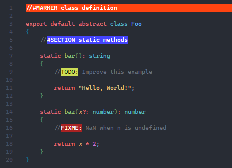
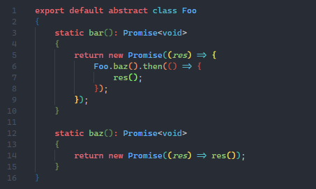

# Teng - Documentation
[Work in Progress]

<br><br>

## Contents:
- [Introduction](#introduction)
- [General Information](#general-information)
    - [Knowledge Requirements](#knowledge-requirements)
    - [Recommendations](#recommendations)
    - [Versioning](#versioning)
- [Code Overview [WIP]](./code-overview.md#readme)

<br><br>

## Introduction:
[WIP]  
  
Still not impressed?  
This list of pros and cons probably isn't gonna help that, but here it is anyway:  

#### Pros:
- No need to learn graphic design, 3D modeling or some other complicated bullshit, the only thing you need is a vivid imagination!
- No complicated C++ pointer fuckery. Teng is written in TypeScript (and is JavaScript compatible), making it comparatively easy and quick to make your own games.
- It's open source! Don't like something or want a new feature? Just open an issue or submit a pull request.

#### Cons:
- There's like no fucking graphics, like... what? Text based games? What is this, the 80s?
- Performance isn't the best, I mean it's an interpreted language, what did you expect?
- Compiled executable size also isn't great, starting at like 100MB for an empty app. But hey, at least it scales somewhat linearly.

<br><br>

## General Information:
This section contains some general info about Teng.

<br>

### Knowledge Requirements:
There are certain things you should know if you want to work with Teng. This section goes over them.  
(TODO)

<br>

### Recommendations:
Working with Teng is pretty easy, however there are certain things that make it even easier.  
> ### Editor Choice:
> To edit the code of your game I recommend using [Visual Studio Code.](https://aka.ms/vscode)  
> It offers a great balance between efficiency, feature richness and usability.  
> Also it is optimized to work with JavaScript and TypeScript so that's a bonus I guess.  
>   
> **Extensions:**  
> Extensions make VS Code even better and more powerful than it already is.  
> Teng makes use of several extensions to make development easier and more clear.  
> To install them, copy the ID and paste it into the `Extensions` tab in the sidebar of VS Code.  
> 
> - **[Highlight](https://marketplace.visualstudio.com/items?itemName=fabiospampinato.vscode-highlight) by [Fabio Spampinato](https://github.com/fabiospampinato) - ID: `fabiospampinato.vscode-highlight`**  
>     This extension makes it possible to declare certain patterns that will then have custom rendering.  
>     You can find these markers all over Teng. They tell you what a certain part of code is used for or if there's still something that needs to be done or fixed.  
>     <details><summary>Click to see an example of what this might look like</summary>
>     
>     </details>
> 
> <br>
> 
> - **[Bracket Pair Colorizer 2](https://marketplace.visualstudio.com/items?itemName=coenraads.bracket-pair-colorizer-2) by [CoenraadS](https://github.com/CoenraadS) - ID: `coenraads.bracket-pair-colorizer-2`**
>     As the name suggests, this extension colors bracket pairs that belong together in the same colors.  
>     This makes it way easier to distinguish code blocks, nested code, etc.  
>     <details><summary>Click to see an example of what this might look like</summary>
>     
>     </details>
> 
> <br>
> 
> - **[EditorConfig for VS Code](https://marketplace.visualstudio.com/items?itemName=editorconfig.editorconfig) by [EditorConfig](https://github.com/EditorConfig) - ID: `editorconfig.editorconfig`**  
>     This extension makes setting workspace-based settings and restraints very easy. This helps provide a bit more consistency throughout Teng and your project.  
>     There's a [`.editorconfig`](../.editorconfig) file at the engine root, which contains the rules on how code should be formatted.  
>     These rules are applied automatically when a file is saved.
> 
> (Most of these extensions are configured in [`.vscode/settings.json`](../.vscode/settings.json), which you need to copy or move to your project's root directory)

<!-- TEMPLATE:

> <br>
> 
> - **[Name](https://marketplace.visualstudio.com/items?itemName=ID_HERE) by [Author](https://github.com/AUTHOR_HERE) - ID: `ID_HERE`**
>     description_here
> 
-->

<br>

### Versioning:
Teng uses Node.js' standard versioning scheme called [SemVer (Semantic Versioning).](https://semver.org/)  
The basic format is:
```
MAJOR.MINOR.PATCH
```

1. MAJOR is incremented if there's very big changes that could break backwards compatibility
2. MINOR is incremented if functionality is added but backwards compatibility is preserved
3. PATCH is incremented when there are backwards compatible bug fixes

For alpha versions, major and minor are set to 0, so the format `0.0.x` is used.  
  
To work with these version numbers, you should use Node's native [`semver` package.](https://www.npmjs.com/package/semver)  
